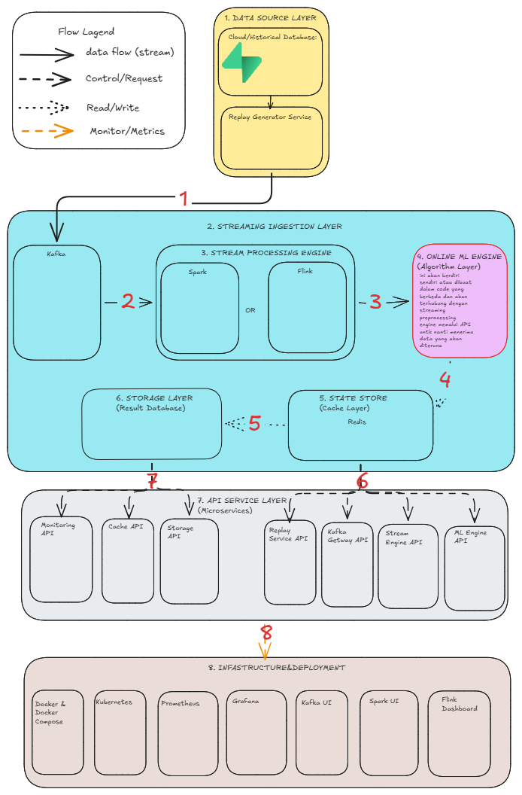

# Adaptive Data Streaming Platform for Online Machine Learning

## Overview

Adaptive Data Streaming Platform for Online Machine Learning merupakan platform penelitian yang dirancang untuk membangun, mengembangkan, dan mengevaluasi sistem Online Machine Learning (OML) pada lingkungan data streaming secara modular, fleksibel, dan mudah dikembangkan.

Platform ini bukan sekadar pipeline data streaming, melainkan sebuah research platform yang menyediakan fondasi arsitektur untuk mengembangkan berbagai algoritma Online Machine Learning secara mandiri tanpa bergantung pada framework tertentu. Seluruh komponen sistem dirancang menggunakan pendekatan microservices sehingga setiap layanan dapat dikembangkan, dijalankan, diperbarui, maupun diganti secara independen tanpa mempengaruhi layanan lainnya.

Fokus utama platform ini adalah menyediakan lingkungan penelitian yang memungkinkan pengembangan model Online Machine Learning secara berkelanjutan dengan tetap mempertahankan skalabilitas, fleksibilitas konfigurasi, serta kemudahan integrasi terhadap berbagai sumber data, message broker, media penyimpanan, maupun sistem monitoring.

---

# Vision

Membangun platform penelitian Online Machine Learning berbasis data streaming yang modular, scalable, configurable, dan extensible sehingga mampu menjadi fondasi pengembangan berbagai algoritma pembelajaran adaptif pada lingkungan data yang terus berkembang.


---

# Mission

Platform ini dikembangkan dengan beberapa tujuan utama sebagai berikut.

- Menyediakan arsitektur data streaming yang modular.
- Memisahkan seluruh komponen sistem menjadi layanan independen.
- Mengembangkan Online Machine Learning Engine secara mandiri tanpa bergantung pada library tertentu.
- Menyediakan Configuration Service sebagai pusat konfigurasi seluruh layanan.
- Menyediakan State Store untuk menyimpan state model secara independen.
- Menyediakan Storage Layer yang dapat terhubung dengan berbagai jenis database.
- Menyediakan Monitoring Dashboard untuk melakukan observasi seluruh layanan secara real-time.
- Menjadi platform penelitian yang dapat terus dikembangkan pada berbagai topik Online Machine Learning.

---

# Design Philosophy

Pengembangan platform mengikuti beberapa prinsip utama berikut.

## Service Independence

Setiap komponen sistem merupakan service yang berdiri sendiri.

Seluruh service memiliki tanggung jawab yang spesifik dan tidak saling bergantung secara langsung.

Komunikasi antar service hanya dilakukan melalui REST API maupun Message Broker.

---

## Loose Coupling

Tidak ada service yang mengetahui implementasi internal service lainnya.

Setiap service hanya mengetahui kontrak komunikasi berupa REST API.

Dengan pendekatan ini setiap service dapat diganti tanpa perlu mengubah layanan lain.

---

## High Configurability

Seluruh konfigurasi sistem harus dapat diubah secara dinamis melalui Configuration Service.

Tidak diperbolehkan terdapat konfigurasi yang di-hardcode di dalam source code.

Seluruh parameter operasional sistem harus dapat diakses melalui REST API.

---

## Extensibility

Seluruh komponen dirancang agar mudah dikembangkan.

Contohnya:

- algoritma OML baru
- storage backend baru
- preprocessing baru
- monitoring baru
- state manager baru

dapat ditambahkan tanpa mengubah arsitektur utama.

---

## Research First

Platform ini dikembangkan sebagai research platform.

Prioritas utama bukan deployment production, melainkan fleksibilitas untuk melakukan eksperimen terhadap berbagai metode Online Machine Learning.

---

# Platform Objectives

Platform ini memiliki beberapa tujuan utama.

## Objective 1

Menyediakan pipeline data streaming yang fleksibel.

Deliverable

- Data Source
- Streaming Preprocessing
- Message Broker
- Online ML Engine

---

## Objective 2

Menyediakan Configuration Service yang mengontrol seluruh layanan.

Deliverable

- REST API Configuration
- Dynamic Configuration
- Runtime Configuration

---

## Objective 3

Menyediakan Online Machine Learning Engine yang dapat dikembangkan secara mandiri.

Deliverable

- Model Management
- Stream Processing
- Feature Processing
- Prediction
- Learning
- Evaluation

---

## Objective 4

Menyediakan State Store untuk menyimpan state model.

Deliverable

- Save State
- Load State
- Delete State
- Versioning

---

## Objective 5

Menyediakan Storage Layer yang independen terhadap database tertentu.

Deliverable

- MongoDB
- PostgreSQL
- Redis
- File Storage

Backend lain dapat ditambahkan tanpa mengubah service lain.

---

## Objective 6

Menyediakan Monitoring Dashboard.

Deliverable

- Health Monitoring
- Service Status
- Configuration Monitoring
- Processing Monitoring
- State Monitoring

---

# System Architecture


Platform terdiri atas beberapa layanan utama.

1. Configuration Service

Berfungsi sebagai pusat konfigurasi seluruh sistem.

Seluruh service mengambil konfigurasi melalui REST API yang disediakan oleh Configuration Service.

---

2. Streaming Preprocessing Service

Melakukan seluruh preprocessing terhadap data sebelum dikirim menuju Message Broker.

Komponen ini bertanggung jawab terhadap validasi data, transformasi, feature engineering, encoding, normalisasi, filtering, serta proses lain yang diperlukan.

---

3. Message Broker

Menghubungkan seluruh pipeline streaming.

Message Broker tidak mengetahui isi data maupun algoritma yang digunakan.

Komponen ini hanya bertugas mengirimkan data antar service.

---

4. Online Machine Learning Engine

Merupakan inti dari platform.

Seluruh penelitian Online Machine Learning dilakukan pada komponen ini.

Komponen ini dikembangkan secara mandiri menggunakan Python tanpa bergantung pada template tertentu.

Seluruh algoritma Online Machine Learning akan dikembangkan di dalam komponen ini.

---

5. State Store Service

Menyimpan seluruh state model.

Pada tahap awal hanya menyimpan model state.

Pada pengembangan selanjutnya dapat diperluas menjadi penyimpanan operational state, checkpoint, cache, maupun state lainnya.

---

6. Storage Layer

Bertindak sebagai abstraction layer terhadap berbagai media penyimpanan.

Komponen ini bertanggung jawab menghubungkan platform dengan berbagai jenis database melalui adapter masing-masing.

---

7. Monitoring Dashboard

Melakukan monitoring terhadap seluruh layanan melalui REST API.

Dashboard tidak berinteraksi langsung dengan database maupun service internal.

Seluruh informasi diperoleh melalui API resmi masing-masing service.

---

# Development Principles

Seluruh pengembangan platform mengikuti aturan berikut.

- Setiap service memiliki repository yang terstruktur.
- Setiap service memiliki REST API.
- Setiap service memiliki endpoint health.
- Setiap service memiliki dokumentasi.
- Setiap service memiliki logging.
- Setiap service memiliki configuration endpoint.
- Setiap service memiliki status endpoint.
- Seluruh komunikasi menggunakan HTTP REST API atau Message Broker.
- Tidak diperbolehkan komunikasi langsung ke database service lain.

---

# Documentation Structure

Dokumentasi platform dibagi menjadi beberapa bagian.

```
docs/

00-README.md

01-System-Overview.md

02-Architecture.md

03-Development-Roadmap.md

04-Configuration-Service.md

05-Streaming-Preprocessing-Service.md

06-Message-Broker.md

07-OnlineML-Engine.md

08-State-Store.md

09-Storage-Layer.md

10-Monitoring-Dashboard.md

11-Shared-SDK.md

12-REST-API-Specification.md
```

Setiap dokumen menjelaskan satu komponen sistem secara detail mulai dari tujuan, tanggung jawab, workflow, struktur folder, API, hingga roadmap pengembangan.

---

# Development Roadmap

Pengembangan platform dilakukan secara bertahap.

Phase 1

Foundation

Target

- Repository
- Documentation
- Development Environment

---

Phase 2

Configuration Service

Target

- REST API
- Runtime Configuration
- Service Registry

---

Phase 3

Streaming Preprocessing Service

Target

- Data Pipeline
- Feature Pipeline
- Validation Pipeline

---

Phase 4

Message Broker Integration

Target

- Publish
- Subscribe
- Queue Management

---

Phase 5

Online Machine Learning Engine

Target

- Learning
- Prediction
- Evaluation
- Experiment

---

Phase 6

State Store

Target

- Save State
- Load State
- State Management

---

Phase 7

Storage Layer

Target

- Database Adapter
- Storage Manager

---

Phase 8

Monitoring Dashboard

Target

- Monitoring
- Visualization
- Service Status

---

# Current Scope

Versi awal platform hanya mencakup komponen berikut.

- Configuration Service
- Streaming Preprocessing Service
- Message Broker
- Online Machine Learning Engine
- State Store
- Storage Layer
- Monitoring Dashboard

Komponen lain akan ditambahkan secara bertahap sesuai roadmap pengembangan.

---

# Long-Term Goals

Platform ini dirancang agar dapat berkembang menjadi lingkungan penelitian Online Machine Learning yang mendukung berbagai algoritma, berbagai jenis data streaming, berbagai backend penyimpanan, serta berbagai mekanisme deployment tanpa mengubah arsitektur inti.

Seluruh komponen dirancang agar tetap modular, configurable, scalable, dan extensible sehingga dapat digunakan sebagai fondasi penelitian jangka panjang.